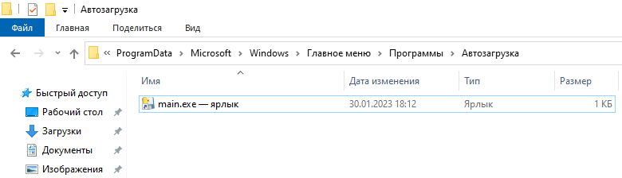

# yuki-emby-crack

> :warning: **Предупреждение**: использование чужого сертификата в качестве доверенного корневого удостоверяющего центра небезопасно. Рекомендуется выпустить свой собственный сертификат!

> Данный репозиторий является ответвлением проекта MitsuhaYuki [yuki-emby-crack](https://github.com/MitsuhaYuki/yuki-emby-crack), служит целям локализации, уточнения справочной информации, актуализации сертификатов "для ленивых" и **НЕ СОДЕРЖИТ ИЗМЕНЕНИЙ В КОДЕ ПРОГРАММЫ!**

## Принцип работы
Каждая программа-клиент Emby активируется отдельно на сервере активации Emby, расположенном в сети Интернет по адресу `mb3admin.com`. Этот проект подменяет сервер активации приложений Emby фейковым сервером активации приложений, расположенным на вашем `localhost`, и удостоверенным фейковым корневым центром сертификации.

## Ограничения
Этот метод ограничен системами и устройствами, на которых возможно перенаправить активацию на фейковый сервер активации и установить сертификат фейкового корневого центра сертификации.

## Результат

> Активированный браузер на Windows


> Активированный Emby Theater на Windows


## Установка

### 1. Разархивируйте файлы

Скачайте `dist.zip` со страницы [`release`](https://github.com/nbb1967/yuki-emby-crack/releases) и разархивируйте его в папку `Документы`: `C:\Users\<UserName>\Documents\dist`


Запустите `main.exe`，в Windows может появиться запрос Брандмауэра защитника Windows，разрешите оба направления.

> вы можете изменить расположение программы，но требуется поместить ее в вашу личную папку，иначе программа может не запускаться из-за недостаточных прав доступа

### 2. Настройте автоматический запуск

Щелкните правой кнопкой по `main.exe`，и выберите `Создать ярлык`，переместите `main.exe - ярлык` в папку `C:\ProgramData\Microsoft\Windows\Start Menu\Programs\StartUp`. Вы можете перименовать ярлык.




### 3. Внесите изменения в файл hosts

Откройте файл `hosts` расположенный в `C:\Windows\System32\drivers\etc`и внесите в конец файла следующую строку：

```
127.0.0.1 mb3admin.com
```

> Программа, в которой вы редактируете файл `hosts` (например, `Блокнот`) должна быть запущена от имени администратора

> После строки `127.0.0.1 mb3admin.com` не забудьте вставить пустую строку，иначе изменения могут быть проигнорированы

### 4. Установите сертификат

Дважды щелкните по файлу `frca.cer` в папке `root`，и выберите `Установить сертификат`. В открывшемся окне выберите `Текущий пользователь` - `Далее` - `Поместить сертификаты в следующее хранилище`，нажмите кнопку `Обзор` и выберите `Доверенные корневые центры сертификации`，затем нажмите `ОК` - `Далее` - `Готово`, чтобы завершить мастер установки сертификата. Подтвердите установку сертификата: `Да` - `OK`


### 5. Перезапустите Emby Server

Щелкните правой кнопкой мыши по значку Emby Server в панели уведомлений и выберите `Перезапуск Emby Server`. Дождитесь пока сервер перезапуститься. Откройте панель управления сервера, вы должны увидеть золотой значок `Emby Premiere`.

### 6. Введите ключ

Перейдите на вкладку `Emby Premiere` и введите любые символы в поле `Ключ Emby Premiere`, нажмите кнопку `Сохранить`.

## FAQ

### Активация не удалась

#### ШАГ1：Проверьте запущена ли программа

Откройте `Диспетчер задач` и прокрутите вниз，если программа запущена，вы должны увидеть 2 процесса `main.exe`


если вы не видите их там, вернитесь к настройке автозапуска，или запустите `main.exe` вручную

#### ШАГ2：Проверьте перенаправление в файле hosts

Запустите `Командную строку` и введите в неё `ping mb3admin.com`，вы должны увидеть что-то похожее:


Если вы не видите адреса 127.0.0.1 значит возникла проблема с файлом hosts и вам нужно вернуться к внесению изменений в файл hosts 

#### ШАГ3：Проверьте наличие проблем с прокси-сервером или сертификатом

Если всё вышеперечисленное в порядке, откройте в браузере адрес [`https://mb3admin.com/`](https://mb3admin.com/), в идеале вы должны увидеть следующее: 


Если вы получаете сообщение об ошибке сертификата, то вернитесь к шагу установки сертификата.
Если вы не видите такой же картины в своем браузере, и на шаге 1 и 2 нет проблем, проверьте не используете ли вы какие-либо прокси-плагины, отключите их, перезапустите браузер и повторите попытку. Если все еще не работает, перейдите в `Параметры Windows` - `Сеть и Интернет` - `Прокси-сервер` и убедитесь что переключатель `Использовать прокси-сервер` выключен.


> Это не значит, что нельзя использовать эту программу совместно с прокси-сервером, нужно лишь добавить адрес `mb3admin.com` в исключения прокси-сервера, чтобы этот адрес открывался напрямую, в обход прокси-сервера. 

#### ШАГ4：Все еще не работает？

Тогда, увы, вам придется решать это самостоятельно.

可以使用CMD以`main.exe > log.txt 2> errorlog.txt`命令运行程序，结束后会生成对应的log文件，可以帮助你检查问题。

## 附加信息

### 关于本项目？

项目基于Python FastAPI框架，寥寥几行无需多讲，无非是加载证书创建web服务器返回一个已激活的信息而已。搞这个东西的初衷也只是为了在windows上的激活更简单一些，经测试可以激活安装在windows上的Emby Server/Emby Theater，原理基于[白嫖一下Emby](https://imrbq.cn/exp/emby_hack.html) 。如非必要本项目一般**不会再次更新**，以及**不会提供技术支持**

### 自行编译？

当然可以，项目使用Python3.8.9，你可以使用pycharm加载该项目，在`terminal`执行

```shell
pip install -r requirements.txt
```

然后运行执行命令

```shell
pyinstaller -F main.spec -w --clean
```

然后你就能在`dist`目录找到编译好的exe文件了，但是还是要配合证书使用

### 关于证书？

证书偷懒了，直接使用了来自于 [embyonekey](https://github.com/s1oz/embyonekey) 项目的证书，如果担心证书存在安全问题，可以依据开头引用的博客中的指引自行申请证书，并替换`cert`目录下的证书文件并重新编译。注意，修改激活服务器证书需要同时签发对应的CA证书以用于客户端激活。

### 关于常见问题-STEP3

我也是偶然发现这个问题，实际上并不是说不能同时使用代理，翻找一下你使用的插件，只需要让你的插件不再代理`mb3admin.com`这个网址即可，例如我使用的Clash for Windows中在Settings里面就有设置系统代理bypass选项，只需要加一行`  - mb3admin.com`即可，如果你没在浏览器页面中看到小金标，看看是不是用了SwitchyOmega或者其他类似插件，如果有的话将`mb3admin.com`加入`不代理的地址列表`，然后刷新页面就能看到小金标啦

### 关于本项目的扩展

从`附加问题-关于本项目`中，有提到这个项目的工作原理。实际上所有emby大家族产品都是同样的激活原理，即向特定激活网址发送请求验证当前客户端的激活信息，而本项目就是充当那个“特定激活网址”的角色。

所以在Windows上，可以通过开放防火墙443端口的方式，将此项目暴露至局域网环境，通过修改同一局域网内其他设备的host即可激活同一局域网内任一设备上的emby程序，具体操作可以自己搜索，此处不再赘述。

## 关于Linux根证书导入失败问题

**此部分教程由 [godvmxi](https://github.com/godvmxi) 编写，在此表示感谢**

### 根证书自签
发现ubuntu下Ca证书一直导入失败，干脆自己签发了一个，参考[OpenSSL 自签 CA 及 SSL 证书](https://2heng.xin/2018/12/16/your-own-ca-with-openssl/)

**关于证书的信任问题，我直接写了个一个小脚本，你自己签发就可以了，window下，自己参考着命令改就行了**

#### 检查openssl设置
创建或者检查/etc/ssl/openssl.cnf

```bash

[ CA_default ]
 
dir             = ./demoCA              # Where everything is kept
certs           = $dir/certs            # Where the issued certs are kept
crl_dir         = $dir/crl              # Where the issued crl are kept
database        = $dir/index.txt        # database index file.
new_certs_dir   = $dir/newcerts         # default place for new certs.
certificate     = $dir/cacert.pem       # The CA certificate
serial          = $dir/serial           # The current serial number
crlnumber       = $dir/crlnumber        # the current crl number
crl             = $dir/crl.pem          # The current CRL
private_key     = $dir/private/cakey.pem# The private key
RANDFILE        = $dir/private/.rand    # private random number file

```

#### 签发自定义Ca
打开root.conf 更改你感兴趣的地方,然后运行./selfsign_ca.sh，一路回车确定完成
```bash
./selfsign_ca.sh

初始化Ca目录


生成 CA 根密钥

Generating RSA private key, 2048 bit long modulus (2 primes)
.............................+++++
...+++++
e is 65537 (0x010001)

自签发 CA 根证书

You are about to be asked to enter information that will be incorporated
into your certificate request.
What you are about to enter is what is called a Distinguished Name or a DN.
There are quite a few fields but you can leave some blank
For some fields there will be a default value,
If you enter '.', the field will be left blank.
-----
Country Name (2 letter code) [CN]:
State or Province Name (full name) [Shanghai]:
Locality Name (eg, city) [Shanghai]:
Organization Name (eg, company) [Mashiro LLC]:
Common Name (e.g. server FQDN or YOUR name) [Mashiro Internet Fake Authority CA]:

重命名ca, pem == crt in linux

'./demoCA/private/cakey.pem' -> './demoCA/private/cakey.crt'

Ca目录

demoCA/
├── cacert.pem
├── index.txt
├── newcerts
├── private
│   ├── cakey.crt
│   └── cakey.pem
└── serial

2 directories, 5 files

```

#### 建立配置文件
进入到sign目录，建立一个你对应的域名目录,并复制server.conf到对应目录,修改对应条目
```bash
mkdir mb3admin.com
cp server.cf mb3admin.com/server.conf
```
更新下列参数
```bash
commonName_default          = *.mb3admin.com
DNS.1   = *.mb3admin.com
DNS.2   = mb3admin.com
```
#### 生成根证书
```bash
selfsign_host.sh mb3admin.com
````
####  证书格式的转换

这里我用的linux，格式一样，如果遇到不一致，可以参考如下解决[证书格式转换DER，PEM等](https://blog.csdn.net/xiangguiwang/article/details/76400805/)

### 使用 Chrome 导入根证书

依次点击设置->隐私设置与安全性->安全->安全证书管理->授权机构->导入


然后可以用浏览器打开https://mb3admin.com 验证是否有错误


