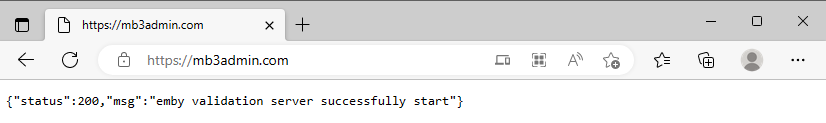

# yuki-emby-crack

> :warning: **Предупреждение**: использование чужого сертификата в качестве доверенного корневого удостоверяющего центра небезопасно. Рекомендуется выпустить свой собственный сертификат!

> Данный репозиторий является ответвлением проекта MitsuhaYuki [yuki-emby-crack](https://github.com/MitsuhaYuki/yuki-emby-crack), служит целям локализации, актуализации сертификатов "для ленивых" и :warning: **НЕ СОДЕРЖИТ ИЗМЕНЕНИЙ В КОДЕ ПРОГРАММЫ!**

## Принцип работы
Каждая программа-клиент Emby активируется отдельно на сервере активации Emby, расположенном в сети Интернет по адресу `mb3admin.com`. Этот проект подменяет сервер активации приложений Emby фейковым сервером активации приложений, расположенным на вашем `localhost`, и удостоверенным фейковым корневым центром сертификации.

## Ограничения
Этот метод ограничен системами и устройствами, на которых возможно перенаправить активацию на фейковый сервер активации и установить сертификат фейкового корневого центра сертификации.

## Результат

> Активированный браузер на Windows


> Активированный Emby Theater на Windows


## Установка

### 1. Разархивируйте файлы

Скачайте `dist.zip` со страницы [`release`](https://github.com/nbb1967/yuki-emby-crack/releases) и разархивируйте его в любую папку. Запустите `main.exe`. 


### 2. Настройте автоматический запуск

Щелкните правой кнопкой по `main.exe`，и выберите `Создать ярлык`，переместите `main.exe - ярлык` в папку `C:\ProgramData\Microsoft\Windows\Start Menu\Programs\StartUp`. Вы можете перименовать ярлык.


### 3. Внесите изменения в файл hosts

Откройте файл `hosts` расположенный в `C:\Windows\System32\drivers\etc`и внесите в конец файла следующую строку：

```
127.0.0.1 mb3admin.com
```

> Программа, в которой вы редактируете файл `hosts` (например, `Блокнот`) должна быть запущена от имени администратора

> После строки `127.0.0.1 mb3admin.com` не забудьте вставить пустую строку，иначе изменения могут быть проигнорированы

### 4. Установите сертификат

Дважды щелкните по файлу `frca.cer` в папке `root`，и нажмите кнопку `Установить сертификат...`. В открывшемся окне выберите `Текущий пользователь` - `Далее` - `Поместить все сертификаты в следующее хранилище`，нажмите кнопку `Обзор` и выберите `Доверенные корневые центры сертификации`，затем нажмите `ОК` - `Далее` - `Готово`, чтобы завершить `Мастер импорта сертификата`. Подтвердите установку сертификата: `Да` - `OK`


### 5. Перезапустите Emby Server

Щелкните правой кнопкой мыши по значку Emby Server в панели уведомлений и выберите `Перезапуск Emby Server`. Дождитесь пока сервер перезапуститься. Откройте панель управления сервера, вы должны увидеть золотой значок `Emby Premiere`. Но это не всё!

### 6. Введите ключ

Перейдите на вкладку `Emby Premiere` и введите любые символы в поле `Ключ Emby Premiere`, нажмите кнопку `Сохранить`.

## FAQ

### Активация не удалась

#### ШАГ1：Проверьте запущена ли программа

Откройте `Диспетчер задач` и прокрутите вниз，если программа запущена，вы должны увидеть 2 процесса `main.exe`


если вы не видите их там, вернитесь к настройке автозапуска，или запустите `main.exe` вручную

#### ШАГ2：Проверьте перенаправление в файле hosts

Запустите `Командную строку` и введите в неё `ping mb3admin.com`，вы должны увидеть что-то похожее:


Если вы не видите адреса 127.0.0.1, значит возникла проблема с файлом hosts и вам нужно вернуться к его редактированию 

#### ШАГ3：Проверьте наличие проблем с прокси-сервером или сертификатом

Если всё вышеперечисленное в порядке, откройте в браузере адрес [`https://mb3admin.com/`](https://mb3admin.com/), в идеале вы должны увидеть следующее: 



Если вы получаете сообщение об ошибке сертификата, то вернитесь к шагу установки сертификата.
Если вы не видите такой же картины в своем браузере, и на шаге 1 и 2 нет проблем, проверьте не используете ли вы какие-либо прокси-плагины, отключите их, перезапустите браузер и повторите попытку. Если все еще не работает, перейдите в `Параметры Windows` - `Сеть и Интернет` - `Прокси-сервер` и убедитесь что переключатель `Использовать прокси-сервер` выключен.


> Это не значит, что нельзя использовать эту программу совместно с прокси-сервером, нужно добавить адрес `mb3admin.com` в исключения прокси-сервера, чтобы этот адрес открывался напрямую, в обход прокси-сервера. 

#### ШАГ4：Все еще не работает？

Тогда, увы, вам придется решать это самостоятельно.

Вы можете запустить программу в командной строке командой `main.exe > log.txt 2> errorlog.txt`. Это создаст файлы журналов в папке программы.

## Дополнительно

### 关于本项目？

项目基于Python FastAPI框架，寥寥几行无需多讲，无非是加载证书创建web服务器返回一个已激活的信息而已。搞这个东西的初衷也只是为了在windows上的激活更简单一些，经测试可以激活安装在windows上的Emby Server/Emby Theater，原理基于[白嫖一下Emby](https://imrbq.cn/exp/emby_hack.html) 。如非必要本项目一般**不会再次更新**，以及**不会提供技术支持**

### Самостоятельная компиляция

当然可以，项目使用Python3.8.9，你可以使用pycharm加载该项目，在`terminal`执行

```shell
pip install -r requirements.txt
```

然后运行执行命令

```shell
pyinstaller -F main.spec -w --clean
```

然后你就能在`dist`目录找到编译好的exe文件了，但是还是要配合证书使用

### О сертификатах?

证书偷懒了，直接使用了来自于 [embyonekey](https://github.com/s1oz/embyonekey) 项目的证书，如果担心证书存在安全问题，可以依据开头引用的博客中的指引自行申请证书，并替换`cert`目录下的证书文件并重新编译。注意，修改激活服务器证书需要同时签发对应的CA证书以用于客户端激活。

### Активация других устройств в локальной сети

Фейковый сервер активации запущен на localhost, и доступен лишь приложениям на этом компьютере. Чтобы сделать его доступным в локальной сети, нужно организовать проброс порта между localhost (127.0.0.1) и IP-адресом того же компьютера в локальной сети <LAN_IP>:
```
netsh interface portproxy add v4tov4 listenport=443 listenaddress=<LAN_IP> connectport=443 connectaddress=127.0.0.1
```
и создать входящее правило в Брандмауэре Windows для 443 порта (не привязывая его к main.exe):
```
netsh advfirewall firewall add rule name=”443 TCP for yuki-emby-crack” protocol=TCP dir=in localip=<LAN_IP> localport=443 action=allow profile=private
```
На компьютере в локальной сети с приложением, которое требуется активировать, нужно установить сертификат фейкового корневого центра сертификации, а в его файле hosts организовать перенаправление на IP-адрес компьютера, на котором запущен фейковый сервер активации.
```
 <LAN_IP> mb3admin.com
```

## 关于Linux根证书导入失败问题

**此部分教程由 [godvmxi](https://github.com/godvmxi) 编写，在此表示感谢**

### Выпуск собственных сертификатов в Windows

Загружаем и устанавливаем последний [Win64 OpenSSL Light](https://slproweb.com/products/Win32OpenSSL.html)  
Запускаем `cmd` от админа

переходим в каталог с `openssl.exe:`

```
cd C:\Program Files\OpenSSL-Win64\bin
```

создаем папки для сертификатов:

```
md root cert code
```

создаем корневой ключ (задаем и повторяем пароль корневого ключа (он не отображается - это нормально)):

```
openssl genrsa -aes256 -out root/frca.key 4096
```

создаем сертификат корневого центра сертификации (подтверждаем паролем корневого ключа):

```
openssl req -key root/frca.key -new -x509 -days 7306 -sha256 -subj "/CN=Fake Root CA for Emby" -addext "basicConstraints = CA:TRUE, pathlen:0" -addext "keyUsage = keyCertSign" -out root/frca.crt
```

создаем ключ сервера (без пароля):

```
openssl genrsa -out cert/server.key 4096
```

создаем сертификат сервера: 

```
openssl req -key cert/server.key -new -x509 -days 3653 -sha256 -CA root/frca.crt -CAkey root/frca.key -subj "/CN=mb3admin.com" -addext "basicConstraints = CA:FALSE" -addext "keyUsage = digitalSignature,keyEncipherment,dataEncipherment" -addext "extendedKeyUsage = serverAuth, clientAuth" -addext "subjectAltName=DNS:*.mb3admin.com,DNS:mb3admin.com" -out cert/server.crt
```

создаем ключ для подписания кода (задаем и повторяем пароль корневого ключа):

```
openssl genrsa -aes256 -out code/codesign.key 4096
```

создаем сертификат подписания кода (подтверждаем паролем ключа подписания кода и паролем корневого ключа):

```
openssl req -key code/codesign.key -new -x509 -days 3653 -sha256 -CA root/frca.crt -CAkey root/frca.key -subj "/CN=Fake Code Signing for Emby" -addext "basicConstraints = CA:FALSE" -addext "keyUsage = digitalSignature" -addext "extendedKeyUsage = codeSigning" -out code/codesign.crt
```

извлекаем `PFX` для подписания приложения (подтверждаем паролем ключа подписания кода, задаем и повторяем пароль для экспорта в `PFX`):

```
openssl pkcs12 -export -out code/codesign.pfx -inkey code/codesign.key -in code/codesign.crt
```

Забираем из папки `root` `frca.crt` - сертификат вашего нового фейкового корневого центра сертификации и устанавливаем его для текущего пользователя в доверенные корневые центры сертификации  
Забираем целиком папку `cert` с файлами `server.crt` и `server.key` - это ваш новый сертификат и ключ фейкового сервера активации - помещаем папку `cert` рядом с `main.exe`  

### Цифровая подпись main.exe

Устанавливаем [Windows 10 SDK](https://developer.microsoft.com/ru-ru/windows/downloads/windows-sdk/): только `App Certification Kit`  
Временно (до окончания сеанса `cmd`) добавляем `signtool` в `PATH`: 

```
set PATH=%PATH%;C:\Program Files (x86)\Windows Kits\10\App Certification Kit
```

Копируем `main.exe` в папку `code`

Подписываем `main.exe` (предварительно заменив <PASSWORD_PFX> на пароль `PFX`):

```
signtool sign /f code/codesign.pfx /p <PASSWORD_PFX> /t http://timestamp.digicert.com /fd SHA256 code/main.exe
```

Из папки `code` забираем подписанный `main.exe`

